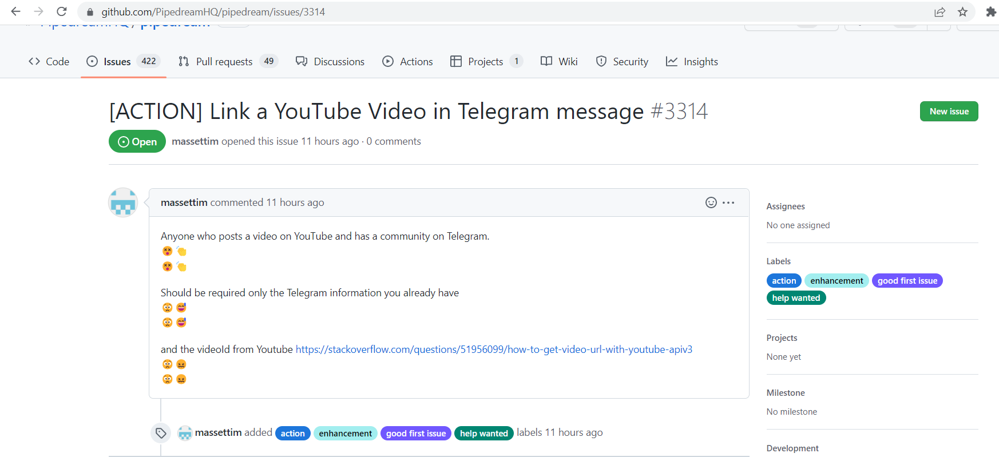
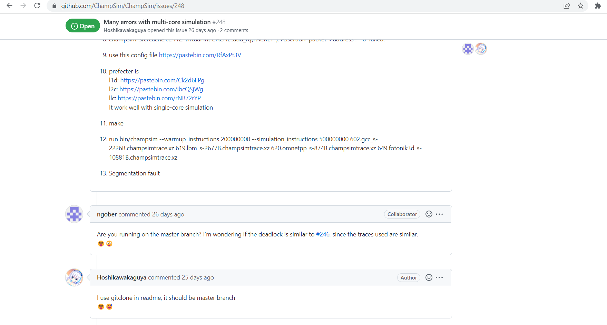
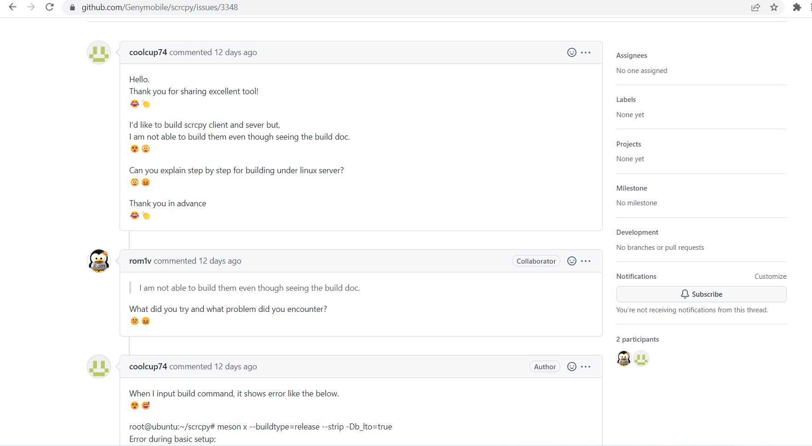

# GitEmo

This work was also done by me under RISHA Lab. This is a simple Chrome Extension that shows emojis on github. It shows emojis on issues, pull requests and commit messages based on their emotions.
This work was inspired by EmoG and StackEmo both done under RISHA Lab by other members. The repositories are forked for your reference.

The screenshots are added below. They show GitEmo in action on some pages and on some comments.

Some emotions shown may not be accurate because the categoried of emotions are few and taken empirically. They are of anger, fear, joy, sadness, surprise, confidence, confused, worried, praise and mistake.

##How it works.
The emotions are analyzed by the python module transformers and uses zero-shot classification. There is a flask server which receives the data from the Chrome Extension and processes it, and sends it back to the extension, which then displays the emojis.

The main file is githubEmo.js and the background file background.js checks that the page is changed and it must take the data again. It is because github does not reload on every page change. Hence, it is necessary to check that the page is changed.

## Dependencies

You must have flask installed, and the transformers module which in turn needs tensorflow. 
You can find how to download it [here](https://huggingface.co/transformers/v3.5.1/installation.html).

## How to Run
After installing all the dependencies, you are ready to go.
To run it, run the flask server first. It may take some time.
Then load the extension in the Chrome Browser by clicking on the three dots in the upper right corner -> More Tools -> Extensions -> Load Unpacked and then load this extension.
Go to any github issues page and you will see the emojis after some time.

